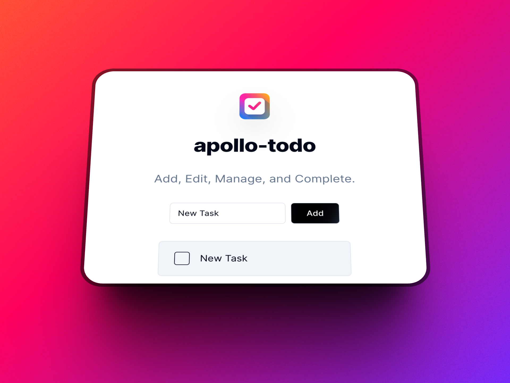

    
    <h1 style="text-align: center; ">
    apollo-todo
</h1>

    
    
    
    
    

 

    <i>
        A simple todo application made using Next.js, GraphQL w/ Apollo Server/Client, Prisma, and Shadcn.
    </i>

 

 
    
    

## Table of Contents

- [Introduction](#introduction)
- [Motivation](#motivation)
- [Getting Started](#getting-started)

## Introduction

`apollo-todo` is a hobby side project made to experiment with different tech that I'm interested in. The stack for this project is:

- [Next.js](https://nextjs.org/)
- [React](https://react.dev/)
- [GraphQL](https://graphql.org/)
- [Apollo](https://www.apollographql.com/)
- [Prisma](https://www.prisma.io/)

Some additional tech that I'm incoporating includes:

- [Shadcn](https://ui.shadcn.com/)
- [Clerk Auth](https://clerk.com/)
- [Codegen](https://the-guild.dev/graphql/codegen)

My chosen JS runtime for this project is [Bun](https://bun.sh/).

## Motivation

This project was created as a way for me to accomplish two goals:

1. To experiment with tech that I've taken an interest in.
2. To better understand and learn:
   1. How to setup an Apollo-graphQL based project
   2. How to properly interact with the cache and manage state changes within it

## Getting Started

1. Install dependencies via: `bun i`
2. Run `docker-compose up`. This docker-compose will create two containers:
   i. The postgresql database
   ii. PgAdmin, which will allow you to connect and manipulate data via the pgadmin GUI.
3. Update the `DATABASE_URL` in your `.env.local` file
4. Once your containers are running, and your secret is updated, execute `bun prisma db push`
5. Sign-up for [Clerk Auth](https://clerk.com/), and obtain the necessary secret keys. Place them in a `.env.local` file located at the root of the project.
6. Execute `bun dev`, and everything should be working 🎉.

### Additional Commands

One additional command that is important is `bun codegen`. This will run the codegen CLI script against the schema & documents that exist within this project, and generate the necessary type files. Additionally, if you only need to generate one set of types, that can be achieved via `bun codegen:client` or `bun codegen:server`

I've also configured my own commit convention via [Commitizen](https://github.com/commitizen/cz-cli) w/ the [cz-emoji-conventional adapter](https://github.com/promet99/cz-emoji-conventional). Running `bun commit` will use the commitizen configuration specified in the package.json.
