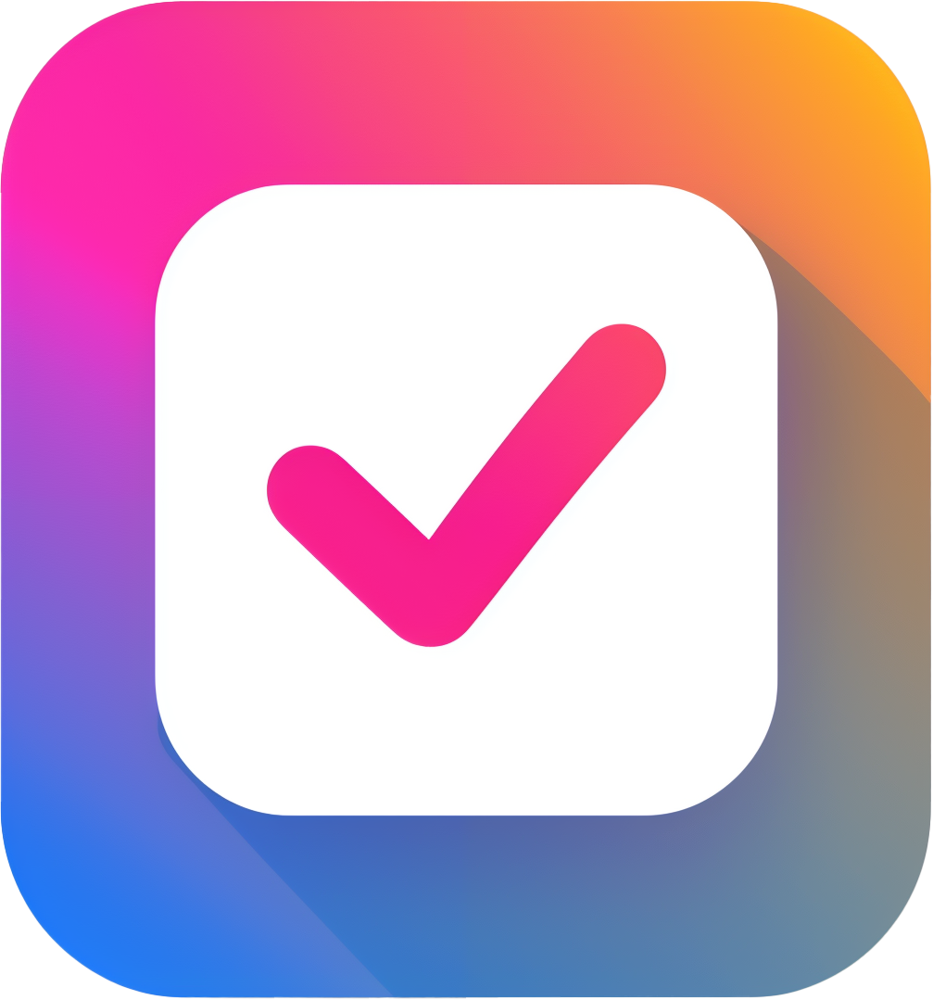

    
    <h1 style="text-align: center; ">
    apollo-todo
</h1>

    
    
    
    

 

`apollo-todo` is a hobby side project made to experiment with different tech that I'm interested in. The stack for this project is:

- [Next.js](https://nextjs.org/)
- [React](https://react.dev/)
- [GraphQL](https://graphql.org/)
- [Apollo](https://www.apollographql.com/)
- [Prisma](https://www.prisma.io/)
- [Shadcn](https://ui.shadcn.com/)
- [Clerk Auth](https://clerk.com/)

I've instead decided to choose [Bun](https://bun.sh/) as my JS runtime.

## Table of Contents

- [Motivation](#Motivation)
- [Getting Started](#getting-started)

## Motivation

This repo was created for two main reasons:

1. To play around with new tech and packages that I've taken an interest in.
2. To experiment with and understand the management of data within the apollo cache, and how to organize and create a GraphQL based project.

## Getting Started

The project can be started in dev mode via: `bun dev`

I've also configured my own commit convention via [Commitizen](https://github.com/commitizen/cz-cli) w/ the [cz-emoji-conventional adapter](https://github.com/promet99/cz-emoji-conventional).

Running `bun commit` will use the commitizen configuration specified package.json.
